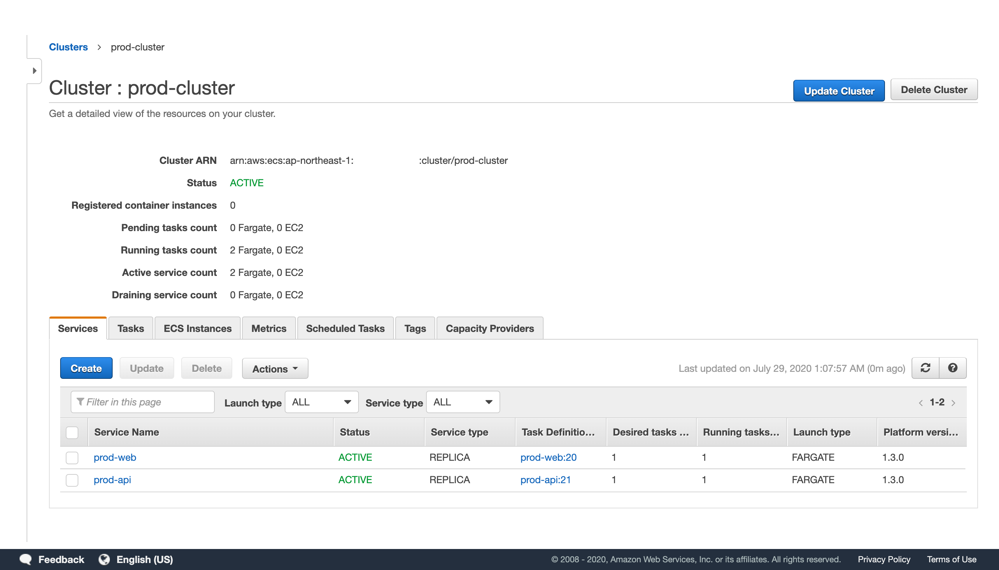
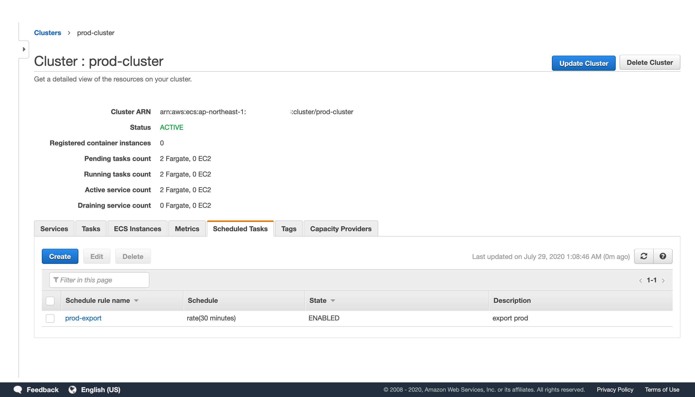
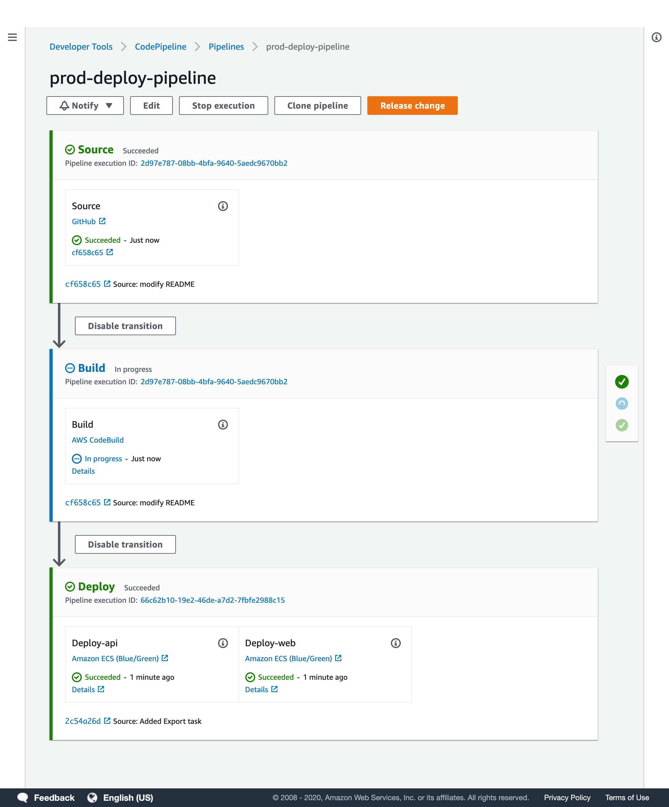

# tf-ecs-fargate-pipeline-example

This is a terraform configuration for deploying a sample Rails application [mpon/rails-blog-example](https://github.com/mpon/rails-blog-example) in Fargate.

This repository is just an example, but we are aiming for a level that can be used even for production operations, and  to complete the CI/CD only with AWS services.

You can use this example to try creating your own AWS infrastructure!

- [x] VPC
- [x] ECS on Fargate
- [x] ECS Application Auto Scaling by Target Tracking Scaling Policies
- [x] ECS Scheduled Task
- [x] CodePipline triggerd by GitHub
- [x] CodeBuild
- [x] CodeDeploy with B/G Deployments
- [x] RDS






## Terraform Structure

```console
.
└── terraform
    ├── common # resources that exist throught account, like a iam, ecr registry etc.
    │   ├── main.tf # provider, terraform backend settings etc.
    │   ├── outputs.tf # to use value from another terraform.state
    │   └── variables.tf # for constant variables
    ├── dev # development environments
    ├── stg # staging environments
    ├── prod # production environments
    └── modules  # terraform module
```

## Requirements

- [aws-cli](https://aws.amazon.com/jp/cli/)
- [tfenv](https://github.com/tfutils/tfenv)

## Getting Started

### 0. environments

```bash
# This example use ap-northeast-1 region
export REGION=ap-northeast-1
# S3 bucket to be used by Terraform remote backend
export TF_VAR_remote_backend=<your s3 bucket>
# GitHub personal token to be used by github provider
export GITHUB_TOKEN=***********************
```

### 1. create remote backend

```bash
aws s3api create-bucket --bucket $TF_VAR_remote_backend --region $REGION \
    --create-bucket-configuration LocationConstraint=$REGION
aws s3api put-bucket-versioning --bucket $TF_VAR_remote_backend --versioning-configuration Status=Enabled
```

### 2. terraform apply(common)

We have to create ECR, IAM, and so on first. This output value will be used by another environments.

```bash
cd terraform/common
make init
make plan
make apply
```

### 3. terraform apply(prod)

Next, create production environments. If you would fail to apply, please retry once or twice.

```bash
cd terraform/prod
make init
make plan
make apply
```

Then, it shows ALB DNS name in terminal, you can access it.

## Clean up

```bash
cd terraform/prod
terraform destroy
```
